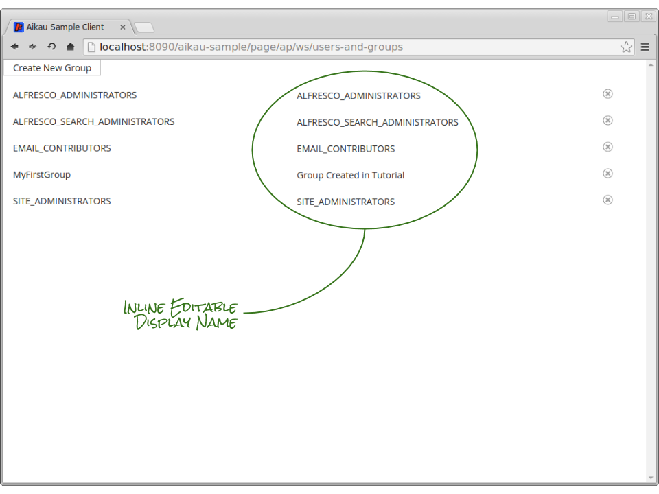
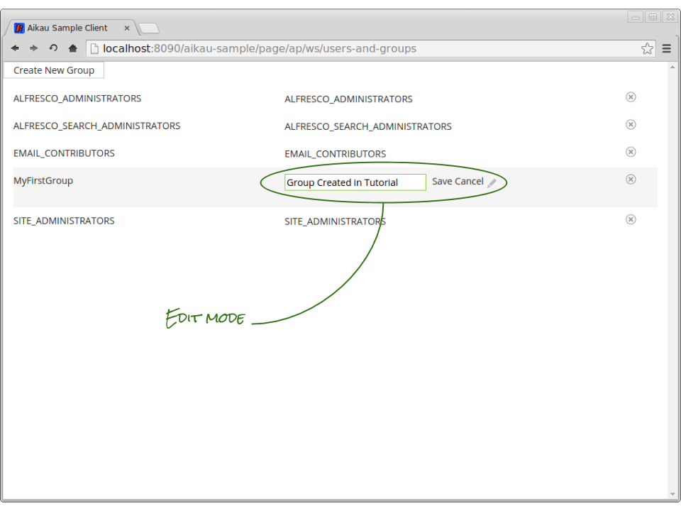
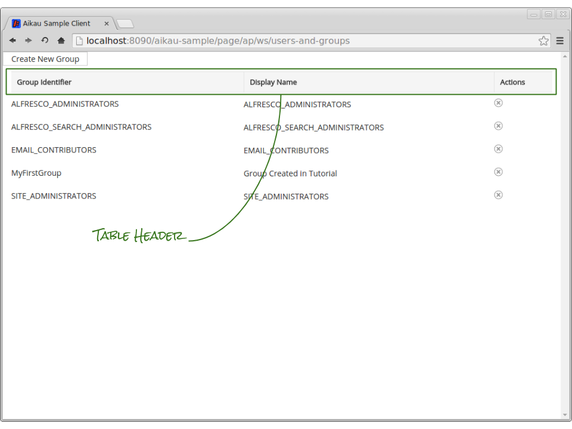
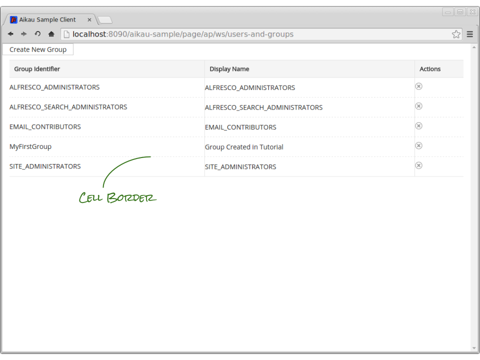
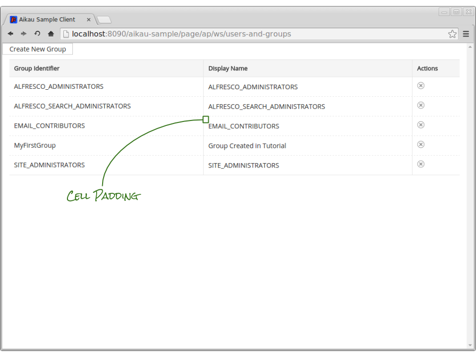

Previous: [Actions in Lists](./Tutorial9.md),
Next: [Sorting and Pagination](./Tutorial11.md)

## Tutorial 10 - Inline Editing Properties

In this tutorial we’ll introduce a renderer that allows a user to edit properties directly within a list and we’ll use this to both display and allow the editing of a group display name. Along the way we’ll improve the general rendering of our list of groups.

### Step 1. Add the InlineEditProperty widget
When you create a group you provide an identifier and a display name. The identifier can never be changed once set and its value is used when working with that group (e.g. adding users and removing users and deleting, etc). The display name is a user friendly name that can be changed at any point.

Our list of groups currently only shows the display name since the `alfresco/renderers/PropertyLink` widget is configured such that the `propertyToRender` attribute is set to `displayName`.

We’re going to add a new renderer for editing the display name so change the `propertyToRender` attribute from `displayName` to `shortName`. 

Now add a new cell widget into the row (between the `alfresco/renderers/PropertyLink` and `alfresco/renderers/PublishAction` widgets) as follows:

```JAVASCRIPT
{
   name: "alfresco/lists/views/layouts/Cell",
   config: {
      widgets: [
         {
            name: "alfresco/renderers/InlineEditProperty",
            config: {
               propertyToRender: "displayName",
               refreshCurrentItem: true,
               requirementConfig: {
                  initialValue: true
               },
               publishTopic: "ALF_CRUD_UPDATE",
               publishPayloadType: "PROCESS",
               publishPayloadModifiers: ["processCurrentItemTokens"],
               publishPayloadItemMixin: false,
               publishPayload: {
                  url: "api/groups/{shortName}",
                  noRefresh: true
               }
            }
         }
      ]
   }
},
```

When you refresh the page you should find that both the group identifier and display name are displayed (quite often these have the same value) and when you hover over the display name an edit icon will appear.



Clicking on this icon will switch into editing mode and allow you to update the display name (for accessibility it is also possible to enter edit mode by giving the widget focus and then pressing the CONTROL and “e” keys).



Let’s go through the configuration attributes that have been used to explain what they’re doing:

Attribute | Purpose
--- | ---
propertyToRender | The `alfresco/renderers/InlineEditProperty` module extends the `alfresco/renderers/Property` module so it inherits its functions and attributes, so we use this in exactly the same way as we have before. 
refreshCurrentItem | Setting this attribute to true will cause the `currentItem` object to be updated with the new value. Because this object is shared between all widgets that use it, they will all benefit from the update.
requirementConfig | When entering edit mode the InlineEditProperty is generating a new `alfresco/forms/Form` widget containing an `alfresco/forms/controls/TextBox` widget. This configuration attribute is simply passed on to that form control.
publishTopic, publishPayloadType, publishPayloadModifiers, publishPayloadItemMixin, publishPayload | Hopefully you should recognize these as being the common attributes that can be configured when using any widget that mixes in the `alfresco/renderers/_PublishPayloadMixin` module. 
noRefresh | This additional attribute in the publication payload is picked up by the CrudService and prevents it from making a publication requesting list reloads (because only a single row has been updated).

### Step 2. List Styling
Our list isn’t looking especially pretty at the moment, let’s do something about that now. First of all lets make our list into more of a table by adding some header cells. In the `alfresco/lists/views/AlfListView` model add the following into the `config` object:

```JAVASCRIPT
widgetsForHeader: [
   {
      name: "alfresco/lists/views/layouts/HeaderCell",
      config: {
         label: "Group Identifier"
      }
   },
   {
      name: "alfresco/lists/views/layouts/HeaderCell",
      config: {
         label: "Display Name"
      }
   },
   {
      name: "alfresco/lists/views/layouts/HeaderCell",
      config: {
         label: "Actions"
      }
   }
],
```

When you refresh the page you’ll see that there is now a header bar above the list that gives an indication of what each column of data represents.



We can do some further styling of the view and cells by setting the `additionalCssClasses` attribute on them. This is the attribute that Aikau uses to allow CSS classes to be added to the widget root DOM element that allows CSS selectors defined in the widget to apply different styling. Add the following to the `alfresco/lists/views/AlfListView` config:

```JAVASCRIPT
additionalCssClasses: "bordered",
```

This will add some dotted lines around the cells in the list as shown:



Update the configuration of each `alfresco/lists/views/layouts/Cell` to include the following:

```JAVASCRIPT
additionalCssClasses: "mediumpad",
```

This will place some padding in each cell (alternative options would be “smallpad” and “largepad”).



Previous: [Actions in Lists](./Tutorial9.md),
Next: [Sorting and Pagination](./Tutorial11.md)
