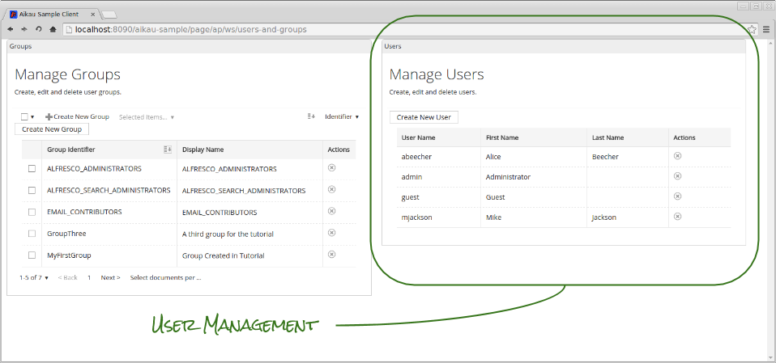

Previous: [Introducing Layout](./Tutorial13.md),
Next: [Introducing Rendering Filters](./Tutorial15.md)

## Tutorial 14 - Recap for User Management

This is going to be less of a tutorial and more of an opportunity to practice what you’ve learned so far. The objective is going to be to fill in the empty space that we’ve created with a list of users.

We’ll step through the process but with less detail than in the previous tutorials - the main information provided will be about the REST APIs on the Alfresco Repository that you need to use.

### Step 1. Create a List
The Alfresco Repository REST API for retrieving users doesn’t support pagination so you won’t be able to implement it here. This means that you can simply use the `alfresco/lists/AlfList` widget.

You can use the `alfresco/services/CrudService` if you’d like, but be aware that the REST API response also doesn’t include a `displayName` property (instead it provides `userName`, `firstName` and `lastName` properties which should be sufficient). If you’d prefer to see a display name constructed from the combined `firstName` and `lastName` attributes then you’ll need to update the `tutorial/UserAndGroupService` and use that.

##### Key information:
* The REST API to call is `api/people?filter=`.
* The array of users is defined as the `people` attribute in the response body (hint: you’ll need to set this as the `itemsProperty` in the AlfList configuration)
* You’ll need to set a `pubSubScope` on the AlfList to ensure its publications don’t affect the other lists.

### Step 2. Create a View
Once again you’ll want to use the `alfresco/lists/views/AlfListView` widget as the root of your view and add a `alfresco/lists/views/layouts/Row` to represent each user. The row should contain a number of `alfresco/lists/views/layouts/Cell` widgets into which you can add the renderers of your choice.

If you want to make the view consistent with the groups list then you’ll want to include a `widgetsForHeader` attribute and remember to set the `additionalCssClasses` attributes on the view and cells.

##### Key information:
* `userName` isn’t editable after creation, but `firstName` and `lastName` are. 

### Step 3. Create User Dialog
You can either use a menu or a button for this (the payload published should be the same) to request a new form dialog for capturing the user information.

You’ll be able to use the `alfresco/services/CrudService` for creating a new user because the `userName` created does not form part of the REST API URL.

##### Key information:
* Use the “ALF_CREATE_FORM_DIALOG_REQUEST” topic to create the dialog.
* The URL to POST to is also `api/people`.
* Set the `formSubmissionTopic` attribute to be: “ALF_CRUD_CREATE”
* You’ll need to include a `formSubmissionPayloadMixin` attribute that is an object containing the following attributes:
  * `url` set to “api/people”
  * `pubSubScope` set to the same value assigned to the `pubSubScope` of the users list widget. 
* The required attributes to include in the POST body are:
  * userName
  * firstName
  * lastName
  * email
  * password

### Step 4. Delete User Action
The simplest approach for this is to use the `alfresco/renderers/PublishAction` widget again, but if you’re feeling adventurous then go ahead and create a multiple user delete menu. 

##### Key information:
* The URL to delete a user is `api/people/{userName}` on a DELETE HTTP method request
* You’ll need to set the `publishPayloadType` to be “PROCESS” and use the `processCurrentItemTokens` processor in order to construct the URL if you use the “alfresco/services/CrudService”
* You’ll need to include the `pubSubScope` in the payload to ensure the correct list gets refreshed

### Step 5. Inline Edit
If you want to allow inline editing of user properties then you can use the `alfresco/renderers/InlineEditProperty` again. Once again the `alfresco/services/CrudService` will be sufficient for your needs here.

##### Key Information:
* The URL to use is `api/people{userName}` again - only this time use the HTTP PUT method
Use the “ALF_CRUD_UPDATE” topic

Once you’ve finished you should end up with something that looks like this:

Previous: [Introducing Layout](./Tutorial13.md),
Next: [Introducing Rendering Filters](./Tutorial15.md)
