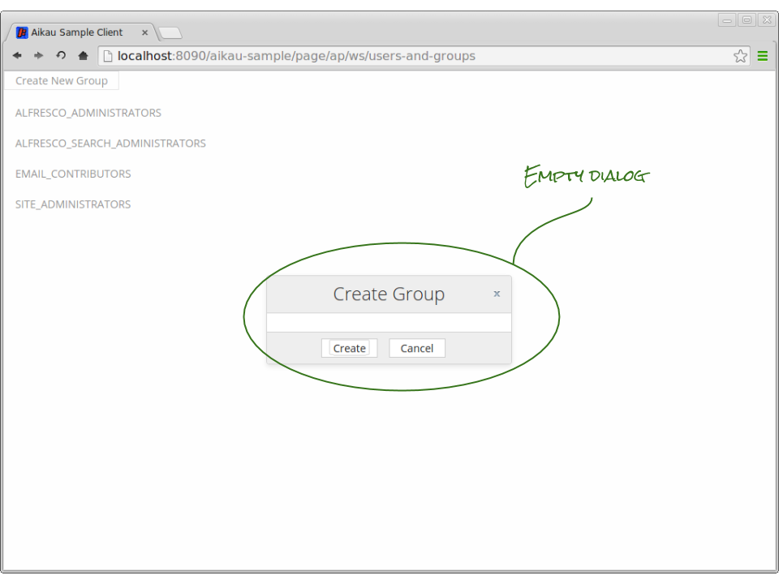
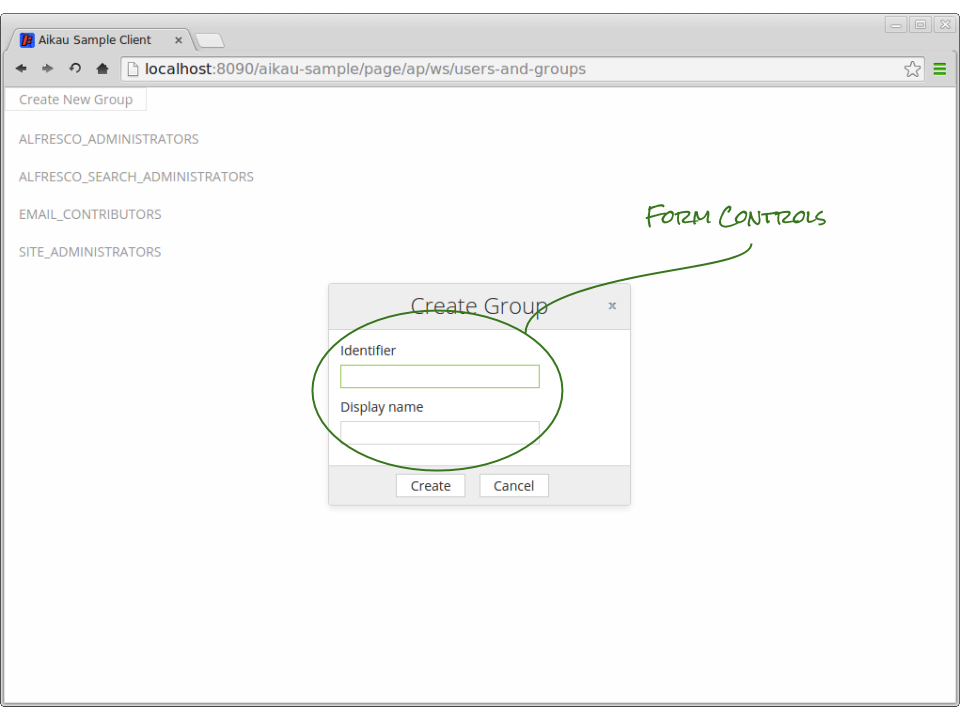
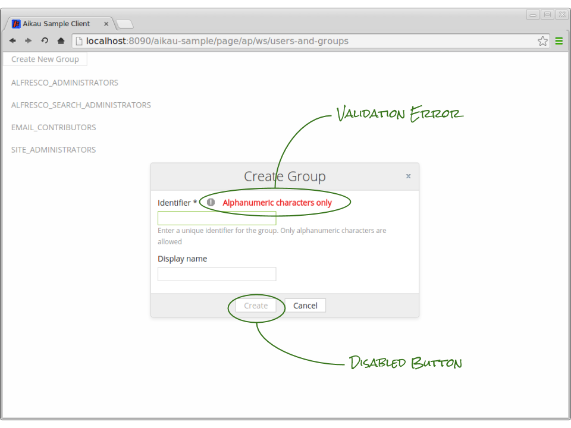
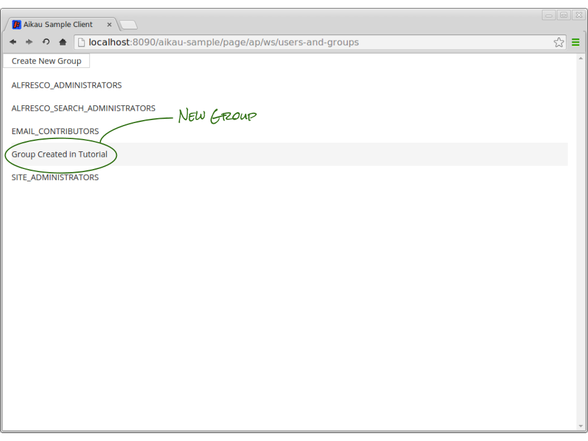

Previous: [Creating a User and Group Management Page](./Tutorial6.md)
Next: [Widget Dialogs](./Tutorial8.md)

## Tutorial 7 - Form Dialogs

In the last tutorial we created a new page for working with users and groups. In this tutorial we’re going to update that page to allow you to create new groups. It’s going to introduce the best way to launch a dialog to capture and process form data.

### Step 1. Display a Dialog
Let’s start by adding a button that will display a new dialog when clicked. This dialog is eventually going to display some text input fields for capturing the ID and display name of the group that we want to create.

Add the following to your page model widgets array above the `alfresco/lists/AlfList` entry:

``` JAVASCRIPT 
{
  name: "alfresco/buttons/AlfButton",
  config: {
    label: "Create New Group",
    publishTopic: "ALF_CREATE_FORM_DIALOG_REQUEST",
    publishPayload: {
      dialogTitle: "Create Group",
      dialogConfirmationButtonTitle: "Create",
      dialogCancellationButtonTitle: "Cancel",
      formSubmissionTopic: "ALF_CRUD_CREATE",
      fixedWidth: true,
      widgets: []
    }
  }
},
```

This will add a button onto the page that is configured to make a request to display a new dialog. However, we need to add another service to our page to handle this request. Add the `alfresco/services/DialogService` into in the array of services so that the start of the JavaScript controller looks like this:

```JAVASCRIPT 
model.jsonModel = {
   services: [
      "alfresco/services/CrudService",
      "alfresco/services/DialogService"
  ],
  widgets: [
```

When you refresh the page you should see a button labelled “Create New Group” which when clicked will display an empty dialog.



Hopefully it should be obvious that the `dialogTitle` attribute has been used for the title of the dialog and the `dialogConfirmationButtonTitle` and `dialogCancellationButtonTitle` attributes have been used for the button labels!

### Step 2. Add Some Form Controls
We now want to add two text boxes into the dialog to capture the ID and display name. We’re going to cover form controls in depth in a later tutorial but for now we are just going to use one of the many form control widgets provided in the `alfresco/forms/controls` package.

Add the following into the empty `widgets` array for your form:

``` JAVASCRIPT
{
  name: "alfresco/forms/controls/TextBox",
  config: {
    fieldId: "ID",
    label: "Identifier",
    name: "groupId"
  }
},
{
  name: "alfresco/forms/controls/TextBox",
  config: {
    fieldId: "DISPLAYNAME",
    label: "Display name",
    name: "displayName"
  }
}
```

This is the most simple configuration possible to add some text boxes. Refresh the page, click the button and you’ll see them added to the page:



### Step 3. Improve Validation
The dialog is a bit sparse at the moment and isn’t very helpful in assisting the user to complete the task of creating a new group. For example there is no information explaining what each field is used for, it is possible to click the confirmation button without data having been entered, and there is no validation of the data that can be provided. Let’s update the configuration for the first form control to address these issues:

```JAVASCRIPT
{
  name: "alfresco/forms/controls/TextBox",
  config: {
    fieldId: "ID",                        
    label: "Identifier",
    name: "groupId",
    description: "Enter a unique identifier for the group. Only alphanumeric characters are allowed",
    requirementConfig: {
      initialValue: true
    },
    validationConfig: [
      {
        validation: "regex",
        regex: "^[A-Za-z0-9]+$",
        errorMessage: "Alphanumeric characters only"
      }
    ]
  }
},
```

Attribute | Purpose
--- | ---
description | This allows us to provide a useful description of the field that explains to the user what the constraints are on the identifier they have provided. 
requirementConfig | This allows us to ensure that the form cannot be submitted until some data for the field has been provided.
validationConfig | This allows us to define a list of the rules that must be true in order for the form to be submitted. In this case we’re providing a [Regular Expression](https://developer.mozilla.org/en/docs/Web/JavaScript/Guide/Regular_Expressions "Link to Mozilla Developer Network documentation") that checks that the identifier provided only contains alphanumeric characters.

When you refresh the page and click on the button you should see the following:



Note that the “Create” button on the dialog is initially disabled. This is because the form does not contain valid data. Try entering invalid and valid data and you’ll see that the button automatically switches from being enabled to disabled as the validity of the form field changes.

### Step 4. Create a Service
We’re now hit with a problem… The URL that we need to use to create a new group is:

`api/rootgroups/{GROUP_NAME}`

...where `{GROUP_NAME}` is the ID of the group that we actually want to create. This presents a problem for the generic CrudService we are currently using - because it doesn’t support modification of its configured REST URL. This means that it’s time to create a new service for working with the user and group APIs.

Create a new file called `UserAndGroupService.js` in the `<PROJECT>/src/main/webapp/js/tutorial` folder and add the following initial contents:

```JAVASCRIPT
define(["dojo/_base/declare",
        "alfresco/core/Core",
        "dojo/_base/lang"],
        function(declare, Core, lang) {
   
  return declare([Core], {
      
    constructor: function tutorial_UserAndGroupService__constructor(args) {
      lang.mixin(this, args);
      this.alfSubscribe("TUTORIAL_CREATE_GROUP", lang.hitch(this, this.createGroup));
    },
      
    createGroup: function tutorial_UserAndGroupService__createGroup(payload) {
    }
  });
});
```

This is the basic structure of all service modules. If you compare it with the `tutorial/HelloWorld` and `tutorial/Label` widget modules we created in earlier tutorials you’ll notice a major difference. It doesn’t extend `dijit/_WidgetBase` because it doesn’t need to follow the standard widget lifecycle. Instead it extends `alfresco/core/Core`.

It’s important to realise that services aren’t forced extend `alfresco/core/Core` however all services and widgets should ideally extend or mixin this module as it provides many of the essential capabilities that they will need - the most important of which are the `alfPublish` and `alfSubscribe` functions.

In the constructor function (which is called when the service is instantiated) you will see this call to `alfSubscribe`:

```JAVASCRIPT
this.alfSubscribe("TUTORIAL_CREATE_GROUP", lang.hitch(this, this.createGroup));
```

This line of code effectively says that whenever the “TUTORIAL_CREATE_GROUP” topic is published on, the `createGroup` function in `this` instance should be called. This is the means by which we’re going to connect our dialog to our service.

### Step 5. Adding XHR Requests
Currently our `createGroup` function does absolutely nothing. We need to update it so that it makes an XHR request to create a group.

Notice that the `createGroup` function has an argument called `payload`. This object will contain the values that have been entered into the form fields on the dialog. We need to take those values and make an XHR request.

To do this we need to include two more dependencies and mix one of them into our service. Update the `UserAndGroupService.js` file to include dependencies on `alfresco/core/CoreXhr` and `service/constants/Default`, so that the start of the file looks like this:

```JAVASCRIPT
define(["dojo/_base/declare",
        "alfresco/core/Core",
        "dojo/_base/lang",
        "alfresco/core/CoreXhr",
        "service/constants/Default"],
        function(declare, Core, lang, CoreXhr, AlfConstants) {
```

Now mix the `alfresco/core/CoreXhr` module into the service:

```JAVASCRIPT
return declare([Core, CoreXhr], {
```

This means that our service will now have access to all the XHR capabilities that the CoreXhr module provides. We now need to update our `createGroup` function to leverage those capabilities. Update it so that it looks like this:

```JAVASCRIPT
createGroup: function tutorial_UserAndGroupService__createGroup(payload) {
  this.serviceXhr({
    url: AlfConstants.PROXY_URI + "api/rootgroups/" + payload.groupId,
    method: "POST",
    data: {
      displayName: payload.displayName
    }
  });
}
```

Now update the page model so that the dialog will publish on this topic when the “Create” button is clicked:

```JAVASCRIPT
{
  name: "alfresco/buttons/AlfButton",
  config: {
            label: "Create New Group",
            publishTopic: "ALF_CREATE_FORM_DIALOG_REQUEST",
            publishPayload: {
               dialogTitle: "Create Group",
               dialogConfirmationButtonTitle: "Create",
               dialogCancellationButtonTitle: "Cancel",
               formSubmissionTopic: "TUTORIAL_CREATE_GROUP",
               fixedWidth: true,
               widgets: [
                  {
```

The `formSubmissionTopic` attribute configures the topic that is published when you click on the confirmation button of the dialog. The payload that is published will be an object containing all the values of the form controls against a key defined by the `name` attribute of each control.

Add our new service to the page:

```JAVASCRIPT
model.jsonModel = {
   services: [
      "alfresco/services/CrudService",
      "alfresco/services/DialogService",
	"tutorial/UserAndGroupService"
  ],
  widgets: [
```

When you refresh the page you will now be able to create a group. However, you will need to refresh the page after creating a new group in order to see the group that you created appear in the list. Let’s fix that now…

### Step 6. Add XHR completion handlers
Obviously you don’t want your users to have to manually refresh the page each time they create a new group. Fortunately the `alfresco/list/AlfList` subscribes to the `ALF_DOCLIST_RELOAD_DATA` topic which when published will force the data to reload.

In order to get the opportunity to publish this topic we need to add a callback handler to our XHR request. Add a new function into the service (`UserAndGroupService.js`)  called `onSuccess`:

```JAVASCRIPT
onSuccess: function tutorial_UserAndGroupService__onSuccess(response, originalRequestConfig) {
  this.alfPublish("ALF_DOCLIST_RELOAD_DATA", {});
}
```

...and update the `createGroup` function so that it looks looks like this:

```JAVASCRIPT
createGroup: function tutorial_UserAndGroupService__createGroup(payload) {
  this.serviceXhr({
    url: AlfConstants.PROXY_URI + "api/rootgroups/" + payload.groupId,
    method: "POST",
    data: {
      displayName: payload.displayName
    },
    successCallback: this.onSuccess,
    callbackScope: this
  });
},
```

These additional attributes in the configuration argument passed to the `serviceXhr` function specify the function to call if the XHR request is successful. If the group is created then the `onSuccess` function will be called, which will in turn publish the “ALF_DOCLIST_RELOAD_DATA” topic which will make the `alfresco/lists/AlfList` reload the latest data… refresh the page and try it out !



Previous: [Creating a User and Group Management Page](./Tutorial6.md)
Next: [Widget Dialogs](./Tutorial8.md)
